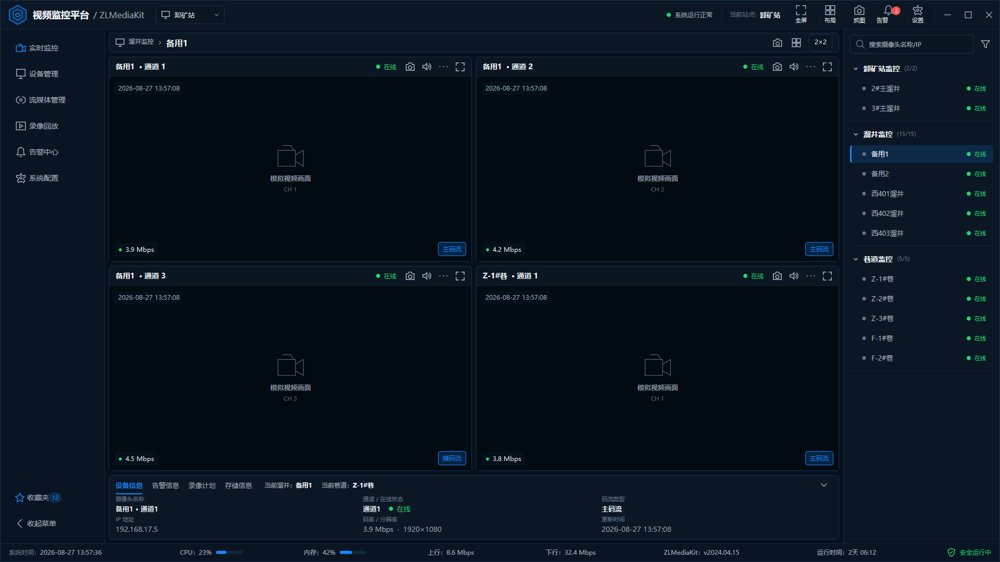
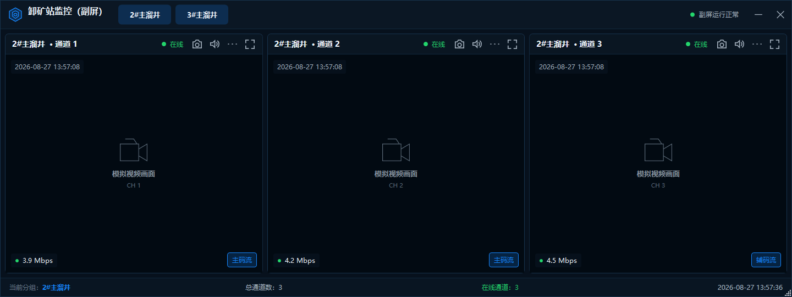

# VideoMonitor

基于 C#、.NET 8 和 WPF 的矿山视频监控桌面客户端。

当前版本处于 **UI 框架与模拟业务切换阶段**。界面采用深色工业监控风格，使用假数据演示固定监控布局和分组联动；尚未接入真实视频流、摄像机 SDK 或数据库。

## 当前效果

### 主屏



### 卸矿站副屏



## 已实现

- WPF 自定义深色窗口框架与统一 Theme / ResourceDictionary
- 主屏固定 2×2 四画面布局
- 主屏前三路固定为溜井监控，第四路固定为巷道监控
- 切换溜井组时，主屏槽位 1、2、3 联动更新，槽位 4 保持不变
- 切换巷道时，只更新主屏槽位 4
- 卸矿站副屏固定 540px 高、单排三等宽视频槽位
- `2#主溜井` / `3#主溜井` 整组三路联动切换
- 双显示器识别与副屏定位；单显示器时显示可拖动测试窗口
- 主屏四画面区域全屏与 Esc 恢复
- 假在线状态、码率、分辨率和系统状态数据
- 核心切换规则单元测试

## 业务布局

主屏固定为 3+1，不支持任意拖拽摄像头：

```text
┌──────────────────┬──────────────────┐
│ 溜井槽位 1       │ 溜井槽位 2       │
├──────────────────┼──────────────────┤
│ 溜井槽位 3       │ 巷道槽位 4       │
└──────────────────┴──────────────────┘
```

副屏只显示卸矿站监控：

```text
┌──────────────┬──────────────┬──────────────┐
│ 通道 1       │ 通道 2       │ 通道 3       │
└──────────────┴──────────────┴──────────────┘
```

默认状态：

- 主屏槽位 1、2、3：`备用1` 三路
- 主屏槽位 4：`Z-1#巷 · 通道1`
- 副屏：`2#主溜井` 三路

## 技术栈

- C#
- .NET SDK 8.0.424
- `net8.0-windows`
- WPF / XAML
- 轻量 MVVM
- CommunityToolkit.Mvvm 8.4.2
- xUnit

项目保留轻量 MVVM 结构，不追求为了“纯 MVVM”进行复杂化改造：

- View / XAML：布局、样式、Binding、Trigger 和 UI 展示
- ViewModel：当前选择、视频槽位、界面状态和用户命令
- Core / Service：固定 3+1、巷道单槽位、副屏三路联动等业务规则
- code-behind：仅保留窗口最大化、最小化、全屏、Esc 和详情折叠等窗口行为

后续外部能力统一通过 Service 接入，ViewModel 不直接处理数据库、厂商 SDK 或媒体服务 API 细节。

## 解决方案结构

```text
VideoMonitor.sln
├─ src/
│  ├─ VideoMonitor.Core/          业务模型、模拟数据和切换服务
│  └─ VideoMonitor.Wpf/           WPF 客户端、View、ViewModel、主题和控件
└─ tests/
   └─ VideoMonitor.Core.Tests/    核心切换逻辑测试
```

主要目录：

```text
src/VideoMonitor.Wpf/
├─ Controls/       VideoTile、MonitorTree、StatusBar
├─ Services/       双屏定位等桌面服务
├─ Themes/         颜色、字体、按钮、控件和矢量图标资源
├─ ViewModels/     主屏、副屏和视频槽位状态
└─ Views/          主监控页和副屏窗口
```

## 开发环境

- Windows 10/11
- Visual Studio 2022，并安装“.NET 桌面开发”工作负载
- .NET SDK 8.0.424；仓库中的 `global.json` 会锁定该 SDK 并允许使用最新补丁版本

检查 SDK：

```powershell
dotnet --version
```

## 构建、测试与运行

```powershell
git clone https://github.com/MrWanCC/VideoMonitor.git
cd VideoMonitor

dotnet restore
dotnet build VideoMonitor.sln
dotnet test VideoMonitor.sln
dotnet run --project src/VideoMonitor.Wpf/VideoMonitor.Wpf.csproj
```

也可以使用 Visual Studio 2022 打开 `VideoMonitor.sln`，将 `VideoMonitor.Wpf` 设置为启动项目后运行。解决方案支持 `Any CPU` 和 `x64`。

如果只有一块显示器，副屏会作为普通的 1440×540 测试窗口显示；如果检测到第二块显示器，副屏会自动定位到第二显示器工作区顶部。

## 分支

- `feature/wpf-video-monitor-ui`：当前 WPF 版本，也是仓库默认分支
- `feature/video-monitor-ui`：早期 WinForms 参考实现
- `master`：基础分支，当前功能分支尚未合并

## 当前未实现

以下能力不在当前阶段范围内：

- ZLMediaKit 接入
- LibVLCSharp 或其他真实视频播放实现
- HCNetSDK / 海康设备 SDK
- SQL Server、SQLite 或其他数据库
- UDP / RTP / RTSP 实际媒体链路
- 录像与录像回放业务
- 告警后台
- 用户与权限管理

当前 `VideoTile` 只显示模拟视频占位。后续接入真实播放能力时，应通过播放和媒体 Service 扩展，不改变现有固定槽位切换规则。
